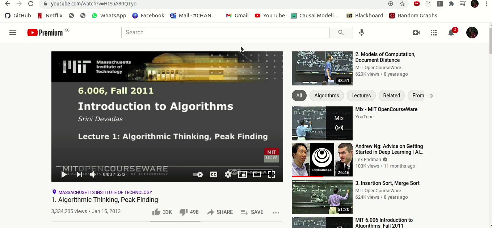

# tldw

tldw - too long didn't watch. A YouTube chrome extension

 

## Getting Started

1. Clone this repository `git clone https://github.com/Aditya239233/tldw.git`
2. Open chrome://extensions
3. Click "LOAD UNPACKED"
4. Select the "client" directory from the cloned repo
5. Restart Chrome

## Todo

[] create a custom text summarizer
